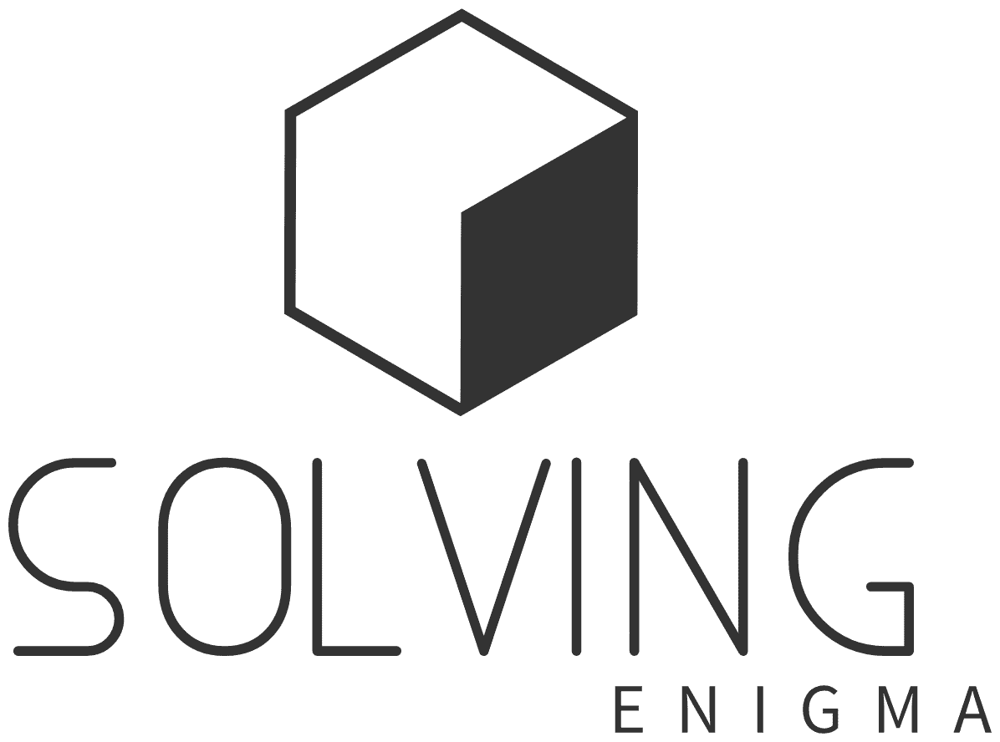

# Enigma

An RSA demonstrator program for the CSL 2.

## Description

This program is hybrid of a game and a demonstrator program. With this terminal app, users can generate a pair of keys, encrypt and decrypt messages. There is also a puzzle-solving game, which asks the user a question and gives them the encrypted answer, so that the user can guess the answer and try to decrypt it. 

## Getting Started

### Dependencies

* C standard libraries
* Ubuntu 22.04 LTS from BFH-Programmation-Procedurale-et-modulaire

### Folder Structure

```markdown
13_holdp1_aitoy1_rsa/
│
├── include/
│   ├── decrypt.h        
│   ├── encrypt.h 
│   ├── io.h 
│   ├── keygen.h
│   ├── user.h 
│
├── src/
│   ├── main.c 
│   ├── decrypt.c           # decrypts messages
│   ├── encrypt.c           # encrypts messages
│   ├── io.c                # handles user input and program output
│   ├── keygen.c            # generates public and private keys
│   ├── user.c              # user helper functions
│
├── doc/
│   └── report.pdf
│   └── worklog_aitoy1.pdf
│   └── worklog_holdp1.pdf
│
├── main
├── Makefile
└── README.md

```

### Installing

* The program has been submitted on moodle as a zip file (13_holdp1_aitoy1_rsa.zip), which has to be extracted
* The program can also be cloned from this git repository

### Executing program

* Extract the contents of the zip file using any program of your choice
* Enter the 13_holdp1_aitoy1_rsa directory
```
cd 13_holdp1_aitoy1_rsa
```
* Compile
```
make
```
* run 
```
make run
```

## Help

If you encounter any issuses, you can contact any of the Contributors by mail.


## Authors

* Paul Holderbaum   [paul.holderbaumondoua@students.bfh.ch](paul.holderbaumondoua@students.bfh.ch)
* Yassin Ait  [yassin.aitouhamou@students.bfh.ch](yassin.aitouhamou@students.bfh.ch)

## Version History

* 0.2
    * Various bug fixes and optimizations
    * See [commit change]() or See [release history]()
* 0.1
    * Initial Release

## License

This project is licensed under the [Bern University of Applied Sciences, 2023. All rights reserved.] 

## Acknowledgments

Inspiration, code snippets, etc.
* [awesome-readme](https://github.com/matiassingers/awesome-readme)
* [geek-for-geeks](https://www.geeksforgeeks.org/)
* [chat-gpt-3.5](https://openai.com/)
* [stack-overflow](https://stackoverflow.com/)
* [git-hub](https://github.com/)

